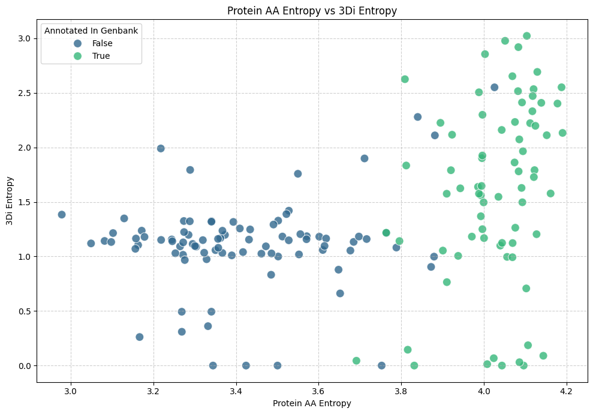
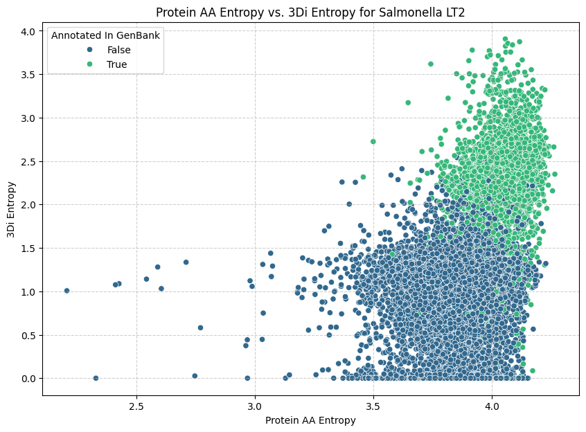

# genome_entropy

[](https://edwards.flinders.edu.au/)
[](https://doi.org/10.5281/zenodo.18312206)
[](https://github.com/linsalrob/genome_entropy/actions)
[](https://linsalrob.github.io/genome_entropy/)
[](https://orf-entropy.readthedocs.io/en/latest/?badge=latest)
[](https://www.python.org/downloads/)
[](https://opensource.org/licenses/MIT)

Quantify information content across multiple biological representations derived from genomic sequences.

**genome_entropy** is a complete bioinformatics pipeline that converts DNA sequences → ORFs → proteins → 3Di structural tokens, computing Shannon entropy at each representation level.

## Comparing genome_entropy

This plot shows a comparison between the protein-level (amino acid) entropy of a set of proteins in our [example GenBank file](example_data/JQ995537.gbk) (_yes, it's crAssphage_) compared to the 3Di entropy. All values were computed by genome_entropy. We have coloured the plot based on whether the ORF was annotated in the GenBank file (i.e. does the ORF encode a protein or not).



Here is a similar plot using all the Open Reading Frames in _Salmonella_ LT2



## Why genome_entropy?

We refer to this framework as **genome-entropy** to emphasise its unifying focus on quantifying information content across multiple biological representations derived from the same genomic sequence. Rather than restricting analysis to a single abstraction, such as nucleotide composition or predicted coding regions, genome-entropy integrates DNA sequences, open reading frames, translated proteins, and structure-derived encodings (3Di) within a common information-theoretic framework. The name reflects both the biological scope of the approach—operating at the level of whole genomes and metagenomes—and the central analytical principle, entropy, which provides a consistent and comparable measure of complexity, organisation, and constraint across representations. This design allows direct comparison of informational signatures across molecular layers while remaining extensible to additional encodings as methods and data evolve.

## Documentation

📚 **[Read the full documentation on GitHub Pages](https://linsalrob.github.io/genome_entropy/)**

📚 **[Read the full documentation on Read The Docs](https://genome-entropy.readthedocs.io/en/latest/)**

The documentation includes:
- Installation guide
- Quick start tutorial
- Complete CLI reference
- Python API documentation
- User guide with detailed explanations
- Developer guide for contributors

## Features

- 🧬 **ORF Finding**: Extract Open Reading Frames from DNA sequences using customizable genetic codes
- 🔄 **Translation**: Convert ORFs to protein sequences with support for all NCBI genetic code tables
- 🏗️ **3Di Encoding**: Predict structural alphabet tokens directly from sequences using ProstT5 or ModernProst models
  - ProstT5 (Rostlab/ProstT5_fp16) - Original model
  - ModernProst-base (gbouras13/modernprost-base) - Newer base model
  - ModernProst-profiles (gbouras13/modernprost-profiles) - Newer model with profile support
- 📊 **Entropy Analysis**: Calculate Shannon entropy at DNA, ORF, protein, and 3Di levels
- 🤖 **ML Classifier**: Train machine learning models to predict GenBank annotations from ORF features
- ⚡ **GPU Acceleration**: Auto-detect and use CUDA, MPS (Apple Silicon), or CPU
- 🚀 **Multi-GPU Support**: Parallelize 3Di encoding across multiple GPUs for faster processing
- 🔧 **Modular CLI**: Run complete pipeline or individual steps
- 📝 **Comprehensive Logging**: Configurable log levels and output to file or STDOUT

## Quick Start

### Installation

#### Running on a cluster

We have installation scripts to run this on either a cluster with [NVIDIA GPUs](slurm/nvidia) or [AMD GPUs](slurm/rocm).

These installation scripts and associated SLURM job submission scripts should get you running!

#### Stand alone 

Install with pip:

```bash
pip install genome-entropy
```

#### For developers

```bash
# Clone repository
git clone https://github.com/linsalrob/genome_entropy.git
cd genome_entropy

# Create virtual environment
python3 -m venv venv
source venv/bin/activate  # On Windows: venv\Scripts\activate

# Install development dependencies (optional)
pip install -e ".[dev]"
```

### Basic Usage

```bash
# Run complete pipeline
genome_entropy run --input examples/example_small.fasta --output results.json

# Or run individual steps
genome_entropy orf --input input.fasta --output orfs.json
genome_entropy translate --input orfs.json --output proteins.json
genome_entropy encode3di --input proteins.json --output 3di.json
genome_entropy entropy --input 3di.json --output entropy.json
```

### Model Selection

genome_entropy supports multiple models for 3Di encoding:

```bash
# Use default ProstT5 model (original)
genome_entropy run --input input.fasta --output results.json

# Use ModernProst base model (newer, faster)
genome_entropy run --input input.fasta --output results.json \
    --model gbouras13/modernprost-base

# Use ModernProst with profiles (for Foldseek profile searches)
genome_entropy run --input input.fasta --output results.json \
    --model gbouras13/modernprost-profiles
```

**Model Comparison:**

| Model | Description | Use Case |
|-------|-------------|----------|
| `Rostlab/ProstT5_fp16` | Original ProstT5 model | Default, well-tested |
| `gbouras13/modernprost-base` | Newer ModernProst base | Faster inference, modern architecture |
| `gbouras13/modernprost-profiles` | ModernProst with profiles | For generating 3Di PSSM profiles for Foldseek |

**Note:** ModernProst models are based on the implementation from [phold](https://github.com/gbouras13/phold) by George Bouras.

### Multi-GPU Usage

Speed up 3Di encoding by distributing batches across multiple GPUs:

```bash
# Auto-discover and use all available GPUs
genome_entropy run --input input.fasta --output results.json --multi-gpu

# Use specific GPUs
genome_entropy run --input input.fasta --output results.json --multi-gpu --gpu-ids 0,1,2

# Works with SLURM job schedulers (GPUs auto-discovered from SLURM_JOB_GPUS)
srun --gres=gpu:4 genome_entropy run --input input.fasta --output results.json --multi-gpu

# Multi-GPU encoding also works for the encode3di command
genome_entropy encode3di --input proteins.json --output 3di.json --multi-gpu
```

**GPU Discovery Priority:**
1. `SLURM_JOB_GPUS` environment variable (SLURM job allocations)
2. `SLURM_GPUS` environment variable
3. `CUDA_VISIBLE_DEVICES` environment variable
4. `torch.cuda.device_count()` (all available GPUs)

See `examples/multi_gpu_example.py` for more usage examples.

### Machine Learning Classifier

Train a classifier to predict whether ORFs are annotated in GenBank:

```bash
# Install ML dependencies
pip install "genome_entropy[ml]"

# Standard mode: Train classifier on JSON output from GenBank files
genome_entropy ml train --json-dir results/ --output model.ubj

# File-based split mode: Randomly split files 80/20 for train/test
genome_entropy ml train --split-dir results/ --output model.ubj \
    --json-output detailed_results.json

# Make predictions on new data
genome_entropy ml predict --json-dir new_results/ --model model.ubj --output predictions.csv
```

**Two modes of operation:**

1. **Standard mode** (`--json-dir`): Uses all files in directory with random sample-level train/test split (default 90/10)
2. **File-based split mode** (`--split-dir`): Randomly splits files 80/20 into training and test sets, trains on training files, evaluates on test files. Outputs detailed JSON report with file lists, training parameters, and per-prediction results.

The ML classifier uses **XGBoost (Gradient Boosted Trees)** by default, which is recommended for this task because:

1. **Excellent performance on structured data** - Consistently achieves state-of-the-art results on tabular datasets
2. **Handles mixed feature types** - Naturally works with continuous (entropy), categorical (strand, frame), and boolean (has_start/stop_codon) features
3. **Built-in GPU support** - Leverages GPU acceleration for faster training
4. **Feature importance** - Shows which features are most predictive (interpretability)
5. **Robust and fast** - Less prone to overfitting, trains quickly
6. **Handles class imbalance** - Works well even when annotations are imbalanced

A PyTorch neural network option is also available for comparison.

**Features used for prediction:**
- Entropy values (DNA, protein, 3Di)
- Sequence lengths
- Genomic position (start, end)
- Structural features (strand, frame, has_start/stop_codon)

See [docs/ML_CLASSIFIER.md](docs/ML_CLASSIFIER.md) for detailed documentation and `examples/ml_classifier_example.py` for a complete example.

## Requirements

### Python Dependencies

- Python 3.8 or higher
- PyTorch >= 2.0.0 (GPU support optional)
- Transformers >= 4.30.0 (HuggingFace)
- pygenetic-code >= 0.1.0
- typer >= 0.9.0

### External Binary: get_orfs

The ORF finder requires the `get_orfs` binary from https://github.com/linsalrob/get_orfs

**Installation:**

```bash
# Clone and build get_orfs
git clone https://github.com/linsalrob/get_orfs.git /tmp/get_orfs
cd /tmp/get_orfs
mkdir build && cd build
cmake ..
make
cmake --install . --prefix ..

# Add to PATH or set environment variable
export PATH="/tmp/get_orfs/bin:$PATH"
# Or set GET_ORFS_PATH environment variable
export GET_ORFS_PATH=/tmp/get_orfs/bin/get_orfs
```

## CLI Commands

### `genome_entropy run` - Complete Pipeline

Run all steps from DNA to 3Di with entropy calculation:

```bash
genome_entropy run \
    --input input.fasta \
    --output results.json \
    --table 11 \
    --min-aa 30 \
    --model Rostlab/ProstT5_fp16 \
    --device auto
```

**Options:**
- `--input, -i`: Input FASTA file (required)
- `--output, -o`: Output JSON file (required)
- `--table, -t`: NCBI genetic code table ID (default: 11)
- `--min-aa`: Minimum protein length in amino acids (default: 30)
- `--model, -m`: Model name (default: Rostlab/ProstT5_fp16)
  - `Rostlab/ProstT5_fp16` - Original ProstT5 model
  - `gbouras13/modernprost-base` - Newer ModernProst base model
  - `gbouras13/modernprost-profiles` - Newer ModernProst with profile support
- `--device, -d`: Device for inference (auto/cuda/mps/cpu)
- `--skip-entropy`: Skip entropy calculation

### `genome_entropy orf` - Find ORFs

Extract Open Reading Frames from DNA sequences:

```bash
genome_entropy orf --input input.fasta --output orfs.json --table 11 --min-nt 90
```

### `genome_entropy translate` - Translate ORFs

Translate ORFs to protein sequences:

```bash
genome_entropy translate --input orfs.json --output proteins.json --table 11
```

### `genome_entropy encode3di` - Encode to 3Di

Convert proteins to 3Di structural tokens using ProstT5 or ModernProst:

```bash
genome_entropy encode3di \
    --input proteins.json \
    --output 3di.json \
    --model Rostlab/ProstT5_fp16 \
    --device auto \
    --batch-size 4
```

### `genome_entropy entropy` - Calculate Entropy

Compute Shannon entropy at all representation levels:

```bash
genome_entropy entropy --input 3di.json --output entropy.json --normalize
```

### `genome_entropy download` - Pre-download Models

Pre-download ProstT5 or ModernProst models to cache:

```bash
# Download default ProstT5 model
genome_entropy download --model Rostlab/ProstT5_fp16

# Download ModernProst models
genome_entropy download --model gbouras13/modernprost-base
genome_entropy download --model gbouras13/modernprost-profiles
```

## Logging

All `genome_entropy` commands support comprehensive logging with configurable output and verbosity.

### Global Logging Options

Every command accepts these logging options:

```bash
genome_entropy [OPTIONS] COMMAND [ARGS]

Global Options:
  --log-level, -l  TEXT  Logging level (DEBUG, INFO, WARNING, ERROR, CRITICAL) [default: INFO]
  --log-file       PATH  Path to log file (default: log to STDOUT)
```

### Usage Examples

**Default logging (INFO level to STDOUT):**
```bash
genome_entropy run --input data.fasta --output results.json
```

**Debug logging to see detailed progress:**
```bash
genome_entropy --log-level DEBUG run --input data.fasta --output results.json
```

**Log to a file:**
```bash
genome_entropy --log-file pipeline.log run --input data.fasta --output results.json
```

**Debug logging to file:**
```bash
genome_entropy --log-level DEBUG --log-file debug.log run --input data.fasta --output results.json
```

**Quiet mode (only warnings and errors):**
```bash
genome_entropy --log-level WARNING run --input data.fasta --output results.json
```

### Log Levels

- **DEBUG**: Detailed information for diagnosing problems (sequence lengths, batch info, etc.)
- **INFO**: General informational messages (default - shows major steps and progress)
- **WARNING**: Warning messages for unusual conditions
- **ERROR**: Error messages for failures
- **CRITICAL**: Critical errors that may cause the program to abort

### What Gets Logged

The logging system tracks:

- **File I/O**: Reading/writing FASTA and JSON files with sequence counts
- **ORF Finding**: Number of ORFs found, binary checks, parsing progress
- **Translation**: Translation progress, codon handling, error details
- **3Di Encoding**: Model loading, batch processing, memory usage, timing estimates
- **Entropy Calculation**: Entropy values at each representation level
- **Pipeline Progress**: Step-by-step progress through the complete pipeline

Example log output (INFO level):
```
2026-01-19 10:30:15 - genome_entropy.io.fasta - INFO - Reading FASTA file: input.fasta
2026-01-19 10:30:15 - genome_entropy.io.fasta - INFO - Successfully read 5 sequence(s) from input.fasta
2026-01-19 10:30:15 - genome_entropy.orf.finder - INFO - Starting ORF finding for 5 sequence(s) (table=11, min_length=90)
2026-01-19 10:30:16 - genome_entropy.orf.finder - INFO - Found 47 ORF(s) in 5 sequence(s)
2026-01-19 10:30:16 - genome_entropy.translate.translator - INFO - Translating 47 ORF(s) with table 11
2026-01-19 10:30:16 - genome_entropy.encode3di.encoder - INFO - Loading ProstT5 model: Rostlab/ProstT5_fp16
2026-01-19 10:30:20 - genome_entropy.encode3di.encoder - INFO - Loaded model Rostlab/ProstT5_fp16 on device cuda
2026-01-19 10:30:20 - genome_entropy.encode3di.encoding - INFO - 3Di encoding batch 1 of 12 batches...
```

## Data Flow

```
DNA FASTA → ORF Finder → ORFs (nucleotides)
          ↓
     Translator → Proteins (amino acids)
          ↓
     ProstT5 → 3Di tokens (structural alphabet)
          ↓
     Shannon Entropy → Entropy Report
```

## Genetic Code Tables

The pipeline supports all NCBI genetic code tables. Common ones:

- **Table 1**: Standard genetic code
- **Table 11**: Bacterial, archaeal, and plant plastid code (default)
- **Table 4**: Mold, protozoan, and coelenterate mitochondrial code

See full list at: https://www.ncbi.nlm.nih.gov/Taxonomy/Utils/wprintgc.cgi

## Output Format

Results are saved as JSON with the following structure:

```json
[
  {
    "input_id": "seq1",
    "input_dna_length": 1000,
    "orfs": [...],
    "proteins": [...],
    "three_dis": [...],
    "entropy": {
      "dna_entropy_global": 2.5,
      "orf_nt_entropy": {"orf1": 1.8},
      "protein_aa_entropy": {"orf1": 3.2},
      "three_di_entropy": {"orf1": 2.9},
      "alphabet_sizes": {"dna": 4, "protein": 20, "three_di": 20}
    }
  }
]
```

## Development

### Running Tests

```bash
# Run unit tests
pytest

# Run with coverage
pytest --cov=genome_entropy

# Skip integration tests (default)
pytest -k "not integration"

# Run integration tests (downloads models, slow)
RUN_INTEGRATION=1 pytest -v -m integration
```

### Code Quality

```bash
# Format code
black src/ tests/

# Lint
ruff check src/ tests/

# Type check
mypy src/genome_entropy/
```

### Project Structure

```
genome_entropy/
├── src/genome_entropy/
│   ├── io/              # FASTA and JSON I/O
│   ├── orf/             # ORF finding and types
│   ├── translate/       # Protein translation
│   ├── encode3di/       # 3Di encoding (ProstT5)
│   ├── entropy/         # Shannon entropy calculation
│   ├── pipeline/        # End-to-end orchestration
│   └── cli/             # Command-line interface
├── tests/               # Unit and integration tests
└── examples/            # Example data and scripts
```

## Citation

If you use this software, please cite:

- **ProstT5**: Heinzinger et al. (2023), "ProstT5: Bilingual Language Model for Protein Sequence and Structure"
- **get_orfs**: https://github.com/linsalrob/get_orfs
- **pygenetic-code**: https://github.com/linsalrob/genetic_codes

## License

MIT License - see [LICENSE](LICENSE) file for details.

## Author

Rob Edwards (@linsalrob)  
Email: raedwards@gmail.com

## Contributing

Contributions welcome! Please:

1. Fork the repository
2. Create a feature branch
3. Add tests for new functionality
4. Ensure all tests pass
5. Submit a pull request

## Troubleshooting

### Common Issues

**ModuleNotFoundError: No module named 'genome_entropy'**
- Run `pip install -e .` from repository root

**get_orfs binary not found**
- Install get_orfs and add to PATH or set GET_ORFS_PATH environment variable

**CUDA out of memory**
- Use CPU with `--device cpu` or reduce batch size with `--batch-size 1`

**Model download fails**
- Check internet connection
- Verify HuggingFace cache permissions (~/.cache/huggingface/)

**Integration tests run unexpectedly**
- Use `pytest -k "not integration"` to skip them

## Acknowledgments

- ProstT5 model by Rostlab
- get_orfs by Rob Edwards
- genetic_codes by Rob Edwards
